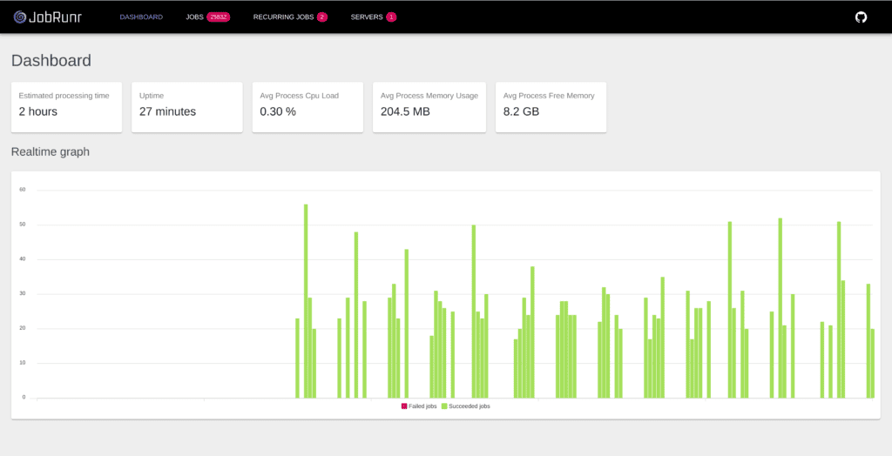
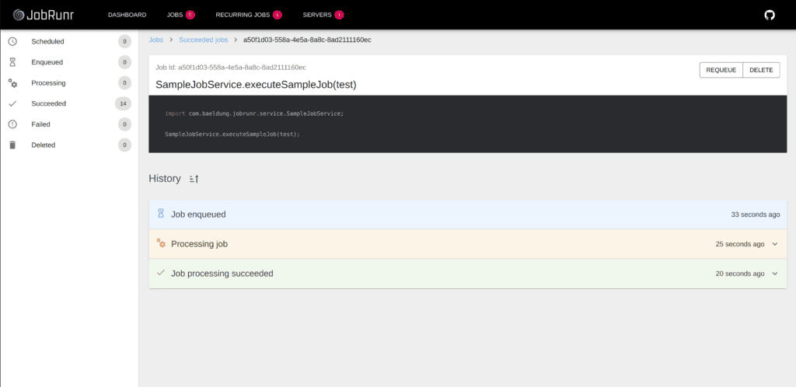

## Getting Started

`JobRunr` is a library that we can embed in our application and which allows us to schedule background jobs using a Java 8 lambda. We can use any existing method of our Spring services to create a job without the need to implement an interface. A job can be a short or long-running process, and it will be automatically offloaded to a background thread so that the current web request is not blocked.

To do its job, JobRunr analyses the Java 8 lambda. It serializes it as JSON, and stores it into either a relational database or a NoSQL data store.

### JobRunr Features
If we see that we’re producing too many background jobs and our server can not cope with the load, we can easily scale horizontally by just adding extra instances of our application. `JobRunr` will share the load automatically and distribute all jobs over the different instances of our application.

It also contains an automatic retry feature with an exponential back-off policy for failed jobs. There is also a built-in dashboard that allows us to monitor all jobs. JobRunr is self-maintaining – succeeded jobs will automatically be deleted after a configurable amount of time so there is no need to perform manual storage cleanup.

### Maven Configuration
Let’s jump straight to the Java code. But before that, we need to have the following Maven dependency declared in our pom.xml file:
```
<dependency>
    <groupId>org.jobrunr</groupId>
    <artifactId>jobrunr-spring-boot-starter</artifactId>
    <version>3.1.2</version>
</dependency>
```
### Spring Integration
Before we jump straight to how to create background jobs, we need to initialize `JobRunr`. As we’re using the `jobrunr-spring-boot-starter` dependency, this is easy. We only need to add some properties to the `application.properties`:
```
org.jobrunr.background-job-server.enabled=true
org.jobrunr.dashboard.enabled=true
```
The first property tells `JobRunr` that we want to start an instance of a BackgroundJobServer that is responsible for processing jobs. The second property tells JobRunr to start the embedded dashboard.

By default, the `jobrunr-spring-boot-starter` will try to use your existing DataSource in case of a relational database to store all the job-related information.

However, since we’ll use an in-memory data store, we need to provide a StorageProvider bean:
```
@Bean
public StorageProvider storageProvider(JobMapper jobMapper) {
    InMemoryStorageProvider storageProvider = new InMemoryStorageProvider();
    storageProvider.setJobMapper(jobMapper);
    return storageProvider;
}
```

### Inject Dependencies
When we want to create jobs, we’ll need to inject the `JobScheduler` and our existing Spring service containing the method for which we want to create jobs, in this case, the `SampleJobService`:
```
private JobScheduler jobScheduler;

private SampleJobService sampleJobService;
```
The JobScheduler class from `JobRunr` allows us to enqueue or schedule new background jobs.

The SampleJobService could be any of our existing Spring services containing a method that might take too long to handle in a web request. It can also be a method that calls some other external services where we want to add resilience as JobRunr will retry the method if an exception occurs.

### Creating Fire-and-Forget Jobs
Now that we have our dependencies, we can create fire-and-forget jobs using the enqueue method:
```
jobScheduler.enqueue(() -> sampleJobService.executeSampleJob());

Jobs can have parameters, just like any other lambda:

jobScheduler.enqueue(() -> sampleJobService.executeSampleJob("some string"));
```
This line makes sure that the lambda – including type, method, and arguments – is serialized as JSON to persistent storage (an RDBMS like Oracle, Postgres, MySql, and MariaDB or a NoSQL database).

A dedicated worker pool of threads running in all the different BackgroundJobServers will then execute these queued background jobs as soon as possible, in a first-in-first-out manner. JobRunr guarantees the execution of your job by a single worker by means of optimistic locking.

### Scheduling Jobs in the Future
We can also schedule jobs in the future using the schedule method:
```
jobScheduler.schedule(LocalDateTime.now().plusHours(5), () -> sampleJobService.executeSampleJob());
```

### Scheduling Jobs Recurrently
If we want to have recurrent jobs, we need to use the scheduleRecurrently method:
```
jobScheduler.scheduleRecurrently(Cron.hourly(), () -> sampleJobService.executeSampleJob());
```

### Annotating with the @Job Annotation
To control all aspects of a job, we can annotate our service method with the @Job annotation. This allows setting the display name in the dashboard and configuring the number of retries in case a job fails.
```
@Job(name = "The sample job with variable %0", retries = 2)
public void executeSampleJob(String variable) {}
```
We can even use variables that are passed to our job in the display name by means of the `String.format()` syntax.

If we have very specific use cases where we would want to retry a specific job only on a certain exception, we can write our own ElectStateFilter where we have access to the Job and full control on how to proceed.

### Dashboard
JobRunr comes with a built-in dashboard that allows us to monitor our jobs. We can find it at `http://localhost:8000` and inspect all the jobs, including all recurring jobs and an estimation of how long it will take until all the enqueued jobs are processed:



### jobrunr overview
Bad things can happen, for example, an SSL certificate expired, or a disk is full. JobRunr, by default, will reschedule the background job with an exponential back-off policy. If the background job continues to fail ten times, only then will it go to the Failed state. You can then decide to re-queue the failed job when the root cause has been solved.

All of this is visible in the dashboard, including each retry with the exact error message and the complete stack trace of why a job failed:



### References
[Jobrunr](https://www.jobrunr.io/en/documentation/configuration/spring/)


